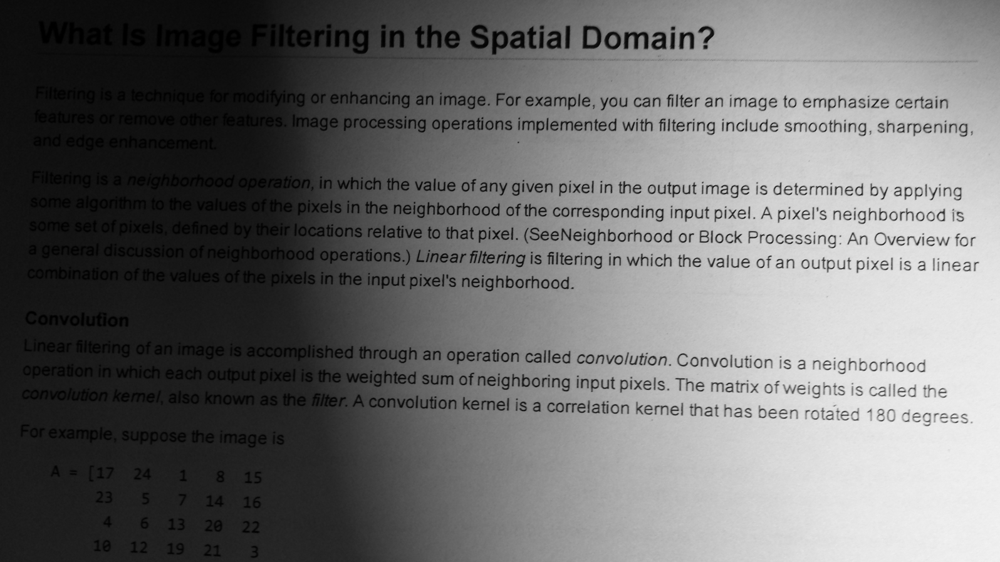
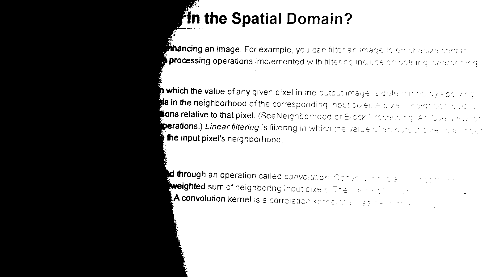
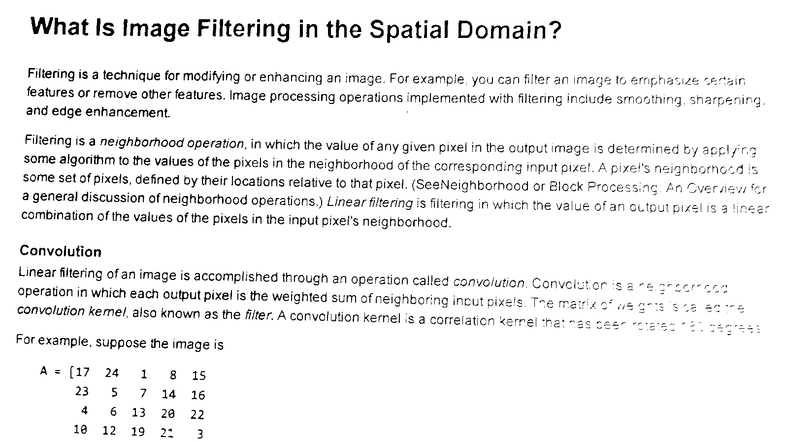
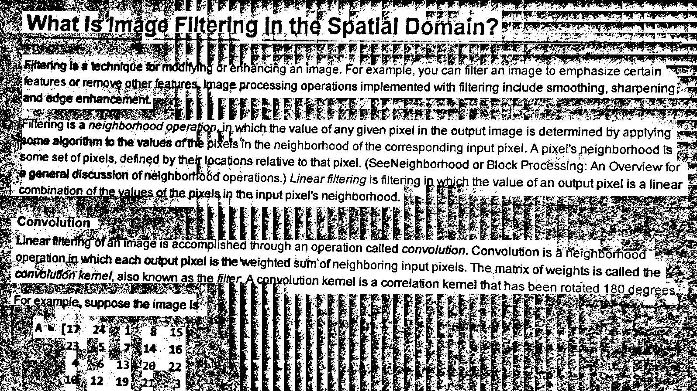
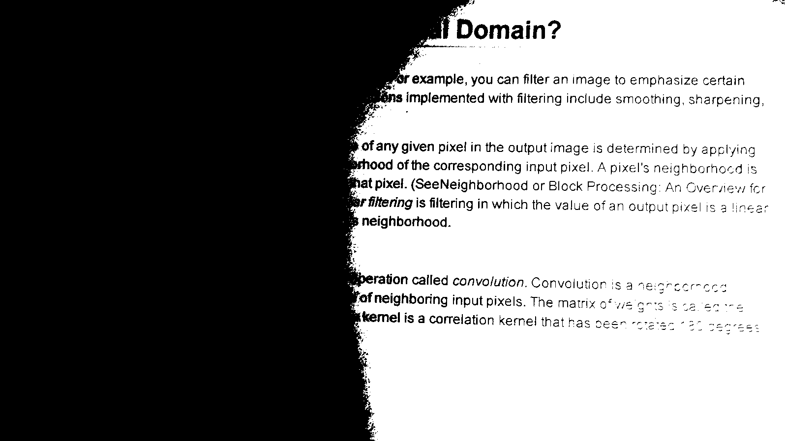

# Binarization

**Introduction**

Reading images and converting them to gray-scale. Then Applying these algorithms

- Constant T = 128
- Global iterative
- Local iterative
  - window size = 25*25
  - window size = 35*35
  - window size = 45*45
- Niblack
- Global OTSU

## Glossary

- Sample image

---------------------------------

- After applying constant t = 128

---------------------------------

- After global iterative

---------------------------------

- After local iterative

---------------------------------

- After local niblack

---------------------------------

- After local otsu

